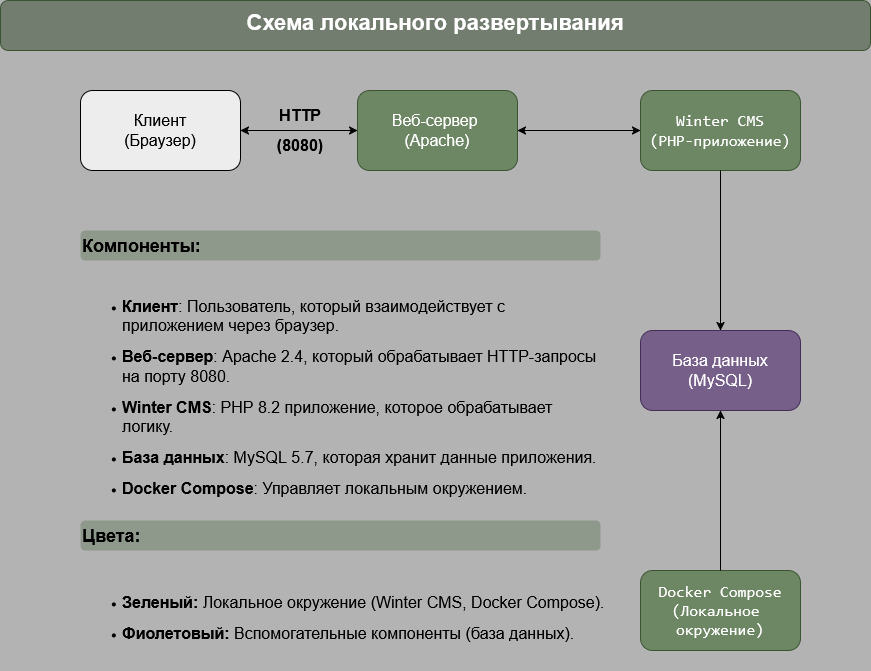
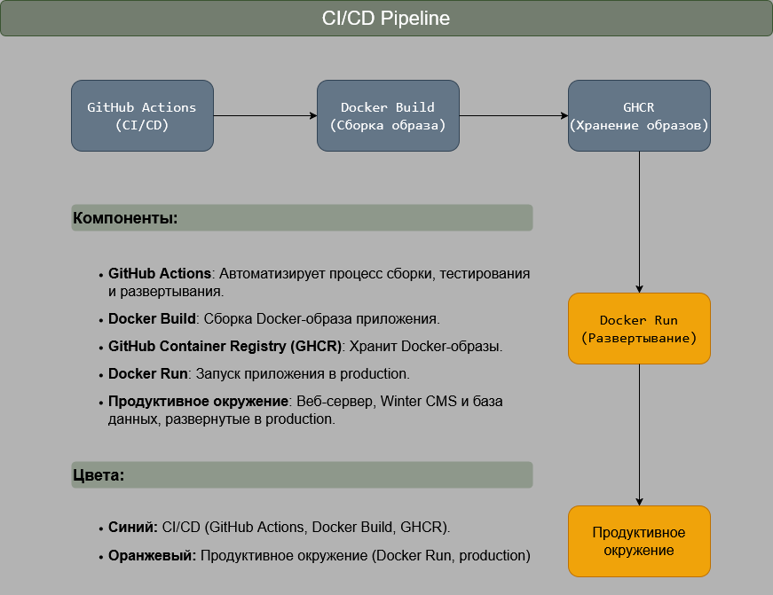
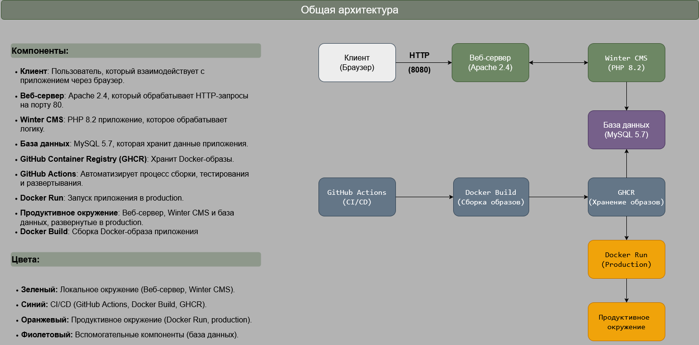

# Winter CMS DevOps
Данный репозиторий представляет собой DevOps-решение для развертывания и управления проекта Winter CMS, настроенное для автоматической сборки, тестирования и развертывания с использованием Docker и GitHub Actions. 
---
## Технологии 🛠
---
| Компонент     | Версия | Описание                                    |
|---------------|--------|---------------------------------------------|
|Winter CMS     | 1.2.7  | PHP-фреймворк для разработки веб-приложений |
|Docker         | 28.0.1 | Для контейнеризации приложения              | 
|Docker Compose | latest | Для управления многоконтейнерным окружением |
|GitHub Actions | latest | Для автоматизации CI/CD                     |
|GHCR           | latest | Хранение Docker-образов                     |
|PHP            | 8.2    | Основной язык backend                       |
|MySQL          | 5.7    | База данных для Winter CMS                  |
|Apache         | 2.4    | Веб-сервер для обслуживания проекта         |
|Redis          | latest | Кеширование и управление сессиями           |
|Grafana        | latest | Визуализация метрик и мониторинг            |

---

## Требования 📋 

---

Для запуска проекта локально или в production вам понадобятся:
- Docker (версия 20.10.0 или выше)
- Docker Compose (версия 1.29.0 или выше)
- GitHub аккаунт (для использования GitHub Actions)
---
## Как запустить проект 🚀
### Способ 1: Локальный запуск
1. Клонируйте репозиторий на ваш компьютер: ```git clone https://github.com/nicekrassss/winter-cms-devops.git```
2. Перейдите в директорию проекта: ```cd winter-cms-devops```
3. Настройка переменных окружения:
    - Создайте файл .env, скопируйте в него содержимое файла .env.example, либо введите команду: ```cp .env.example .env```
    - Введите команду для автоматической подстановки ключа в файл .env: ```docker-compose run --rm artisan key:generate >> .env```
    - Или сгенерируйте ключ: ```docker-compose run --rm artisan key:generate --show```, а затем
    - Скопируйте сгенерированный ключ и вставьте его в файл .env в строку APP_KEY=
4. Запустите проект с помощью Docker Compose:
 docker-compose up
> Приложение будет доступно в браузере по адресу: http://localhost:8080

> База данных MySQL будет доступна на порту 3306

> Grafana будет доступна по адресу: http://localhost:3000

> Логи можно просмотреть с помощью команды: ```docker-compose logs```

> Для остановки проекта выполните команду: ```docker-compose down```

### Способ 2: Использование готового Docker-образа
1. Скачайте образ: ```docker pull ghcr.io/nicekrassss/winter-cms-devops:latest```
2. Запустите образ: ```docker run -p 8080:80 ghcr.io/nicekrassss/winter-cms-devops:latest ``` или ```docker run -p 8080:80 -v "${pwd}\.env:/var/www/html/.env" ghcr.io/nicekrassss/winter-cms-devops:latest``` (если нужно монирование .env при запуске контейнера)
> На этом этапе приложение будет доступно по адресу: http://localhost:8080, база данных будет не доступна.  

> Для ее активации скачайте из репозитория файл [docker-compose.yml](docker-compose.yml) в вашу локальную директорию
3. Запустите проект: ```docker-compose up```
> Приложение будет доступно в браузере по адресу: http://localhost:8080 

> База данных MySQL будет доступна на порту 3306

> Grafana будет доступна по адресу: http://localhost:3000

> Логи можно просмотреть с помощью команды: ```docker-compose logs```

> Для остановки проекта выполните команду: ```docker-compose down```
---
## CI/CD Pipeline 🔄 
---
В проекте используется GitHub Actions для автоматизации сборки, тестирования и развертывания. Для использования нужно настроить секреты. Основные этапы CI/CD:
1. Build: Подготовка окружения, установка зависимостей (с кэшированием Composer и npm) и сборка Docker-образа.
2. Test: Запуск тестов для проверки корректности работы приложения с использованием кэшированных зависимостей.
3. Deploy: Загрузка Docker-образа в GitHub Container Registry.
Варианты использования CI/CD Pipeline:
1. Автоматический запуск: при каждом push в ветку main workflow автоматически запускается
2. Ручной запуск: вы можете вручную запустить workflow через интерфейс GitHub Actions (название - Winter CMS CI/CD)
3. Просмотр логов: логи каждого этапа можно просмотреть в разделе Actions вашего репозитория
> Расположение файла в репозитории: .github/workflows/ci.yml [ci.yml](.github/workflows/ci.yml)
---
## Настройка секретов 🔒 
---
В файле ci.yml используется секрет GHCR_TOKEN (токен для доступа к GitHub Container Registry). Сначала нужно сгенерировать собственный токен, затем добавить его в секрет.
Создание токена:
1. Перейдите в Settings (аккаунта) - Developer settings - Personal access tokens
2. Нажмите Generate new token (подойдет классический)
3. Укажите срок действия токена (по предпочтению)
4. Выберите права: 
    read:packages (для чтения образов из GHCR)
    write:packages (для загрузки образов)

Добавление секретов:
1. Перейдите в Settings (репозитория) - Secrets and variables - Actions
2. Нажмите New repository secret
3. Добавьте секрет GHCR_TOKEN и вставьте сгенерированный токен
---
## Как внести изменения 🛠
---
1. Локальная разработка
    - Внесите изменения в код
    - Запустите docker-compose up для проверки изменений
    - Проверьте, что приложение работает корректно
2. Обновление CI/CD
    - Измените файл .github/workflows/ci.yml, если нужно обновить этапы сборки или развертывания
    - Убедитесь, что все тесты проходят успешно
3. Обновление Dockerfile
    - Внесите изменения в Dockerfile, если нужно добавить новые зависимости или изменить конфигурацию
    - Пересоберите Docker-образ: ```docker-compose build```
4. Обновление docker-compose.yml
    - Внесите изменения в docker-compose.yml, если нужно добавить новые сервисы или изменить конфигурацию существующих
    - Перезапустите проект: ```docker-compose up```
5. Обновление Grafana и Redis
Для изменения Dashboard Grafana:
    Способ 1:
        - Экспортируйте файл [redis_dashboard.json](redis_dashboard.json) 
        - Измените строчку ```"uid": "redis_monitoring_v2"``` (в кавычках укажите, например, новое название Dashboard)
        - Dashboard появится у вас в Grafana
    Способ 2:
        - Экспортируйте текущий Dashboard через JSON Model
        - Внесите изменения в JSON-файл
        - Импортируйте обновленный Dashboard в Grafana
Для изменения конфигурации Redis:
    - Внесите изменения в [docker-compose.yml](docker-compose.yml) (например, порты или переменные окружения)
    - Перезапустите проект: ```docker-compose up```

---
## Архитектура 📊
---
Схема локального развертывания:

Схема CI/CD Pipeline: 

Схема продуктивного развертывания:

Схема общей архитектуры:

---
## Сценарий масштабирования серверов для выдерживания большой нагрузки
---
Для мониторинга и масштабируемости проекта были добавлены:
    - Redis: для кеширования и управления сессиями.
    - Grafana: для визуализации метрик Redis и других данных.
1. Redis: 
    Настроен как сервис в [docker-compose.yml](docker-compose.yml)
    Используется для кеширования и хранения сессий
    Проверка работы Redis после запуска контейнеров проекта: ```docker-compose exec redis redis-cli ping```
    Ожидаемый ответ: PONG
2. Grafana:
    Настроен как сервис в [docker-compose.yml](docker-compose.yml)
    Добавлен плагин Redis Data Source для подключения к Redis
    Создан Dashboard для мониторинга ключевых метрик Redis:
        Memory Usage (использование памяти)
        Connected Clients (количество активных подключений)
        Operations per Second (количество команд в секунду)
> Dashboard содержится в файле [redis_dashboard.json](redis_dashboard.json)
После запуска проекта Grafana будет доступна по адресу: http://localhost:3000
Чтобы посмотреть Dashboard:
    1. Откройте Grafana по адресу http://localhost:3000
    2. Перейдите в Dashboards - Manage, там будет redis_dashboard
    3. Убедитесь, что данные отображаются: Memory Usage, Connected Clients, Operations per Second
---
## История изменений 📝
1. Обновление [composer.json](composer.json) 
- Добавлены настройки автозагрузки PSR-4 для модулей и приложения
Это нужно было, чтобы обеспечить корректную автозагрузку классов в проекте и соответствие стандарту PSR-4
Добавленный код: 
"autoload": {
    "psr-4": {
        "Backend\\": "modules/backend",
        "System\\": "modules/system",
        "Cms\\": "modules/cms",
        "App\\": "app"
    }
},
"autoload-dev": {
    "psr-4": {
        "Tests\\": "tests"
    }
}
2. Добавление docker-entrypoint.sh
- Создан файл [docker-entrypoint.sh](docker-entrypoint.sh) для выполнения команд при запуске контейнера
Это нужно было для автоматического выполнения команд для нужных проверок после запуска контейнера 
---
## Лицензия 📜
Этот проект распространяется под лицензией MIT. Подробности см. в файле [LICENSE](LICENSE)